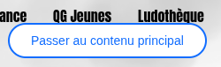
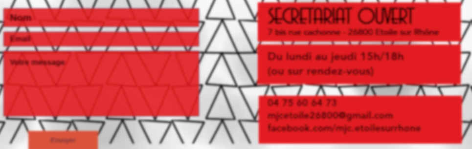
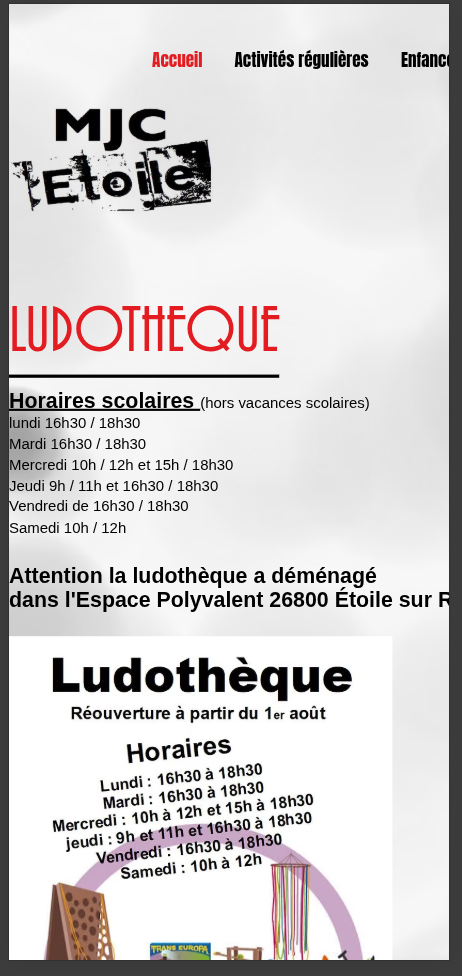
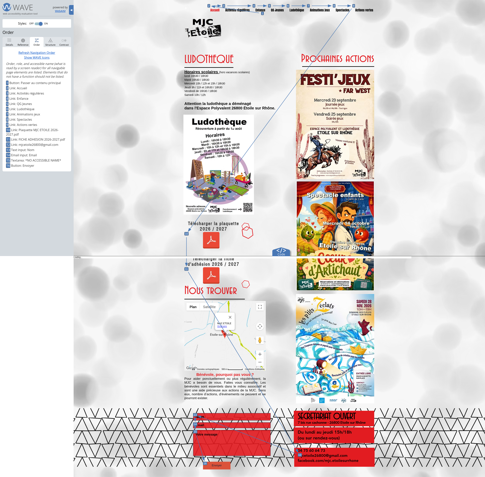
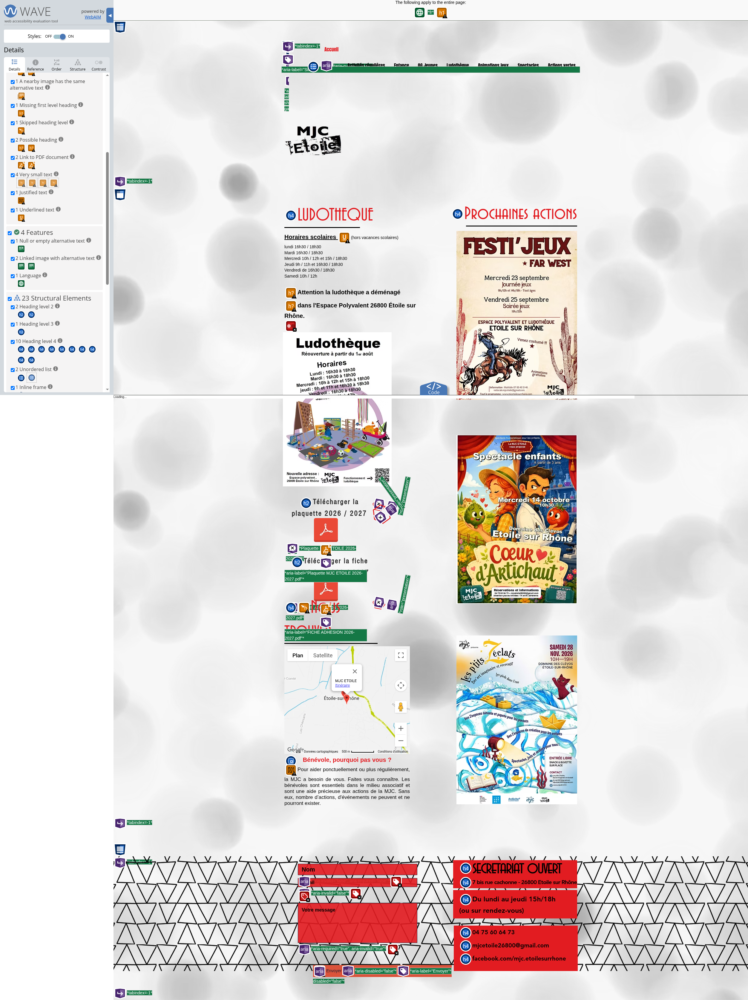
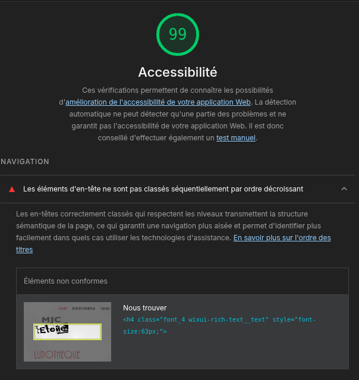

# Audit d’accessibilité

**Site évalué :** [mjcetoilesurrhone.com](https://www.mjcetoilesurrhone.com/)

## Résultats

| Outil / indicateur | Résultat |
| --- | ---: |
| Erreurs détectées | 6 |
| Error score | 16 % (1/6 = 0.1667) |
| AIM score | 7,8 / 10 (78 %) |
| Lighthouse accessibilité | 99 % |
| Moyenne des trois scores | **64,33 %** |

La moyenne correspond à `(16 + 78 + 99) / 3`. Le score d’erreur est repris tel qu’affiché par l’outil.

## Problèmes relevés

- Trois images possèdent le même identifiant HTML (`img_undefined`).
- Le champ « Nom » n’a pas de libellé accessible.
- Le champ « Email » n’a pas de nom accessible.

Les liens d’évitement ou d’accès rapide sont présents.

### Liens d’évitement




## Tests d’affichage

À un zoom de **140 %** ou plus, la mise en page se dégrade : le site ne s’adapte plus correctement à la fenêtre et reste contraint au format 16:9.

Comme le suggérait le test précédent, le site présente également un défaut d’affichage adaptatif : sur un iPhone 16 Pro Max, la mise en page reste contrainte au format 16:9.

Le parcours de page au clavier a également été testé. Les captures ci-dessous illustrent les observations.

Les défauts visuels ont été testés. Seul l’affichage trouble est réellement illisible ; les autres restent entièrement exploitables grâce au bon contraste du site et à ses trois couleurs principales : le rouge, le blanc et le noir.


### Affichage trouble



### Affichage sur mobile



### Parcours de page au clavier



## Conclusion

**Bilan :** résultat acceptable, mais plusieurs améliorations d’accessibilité restent à apporter, notamment sur les champs de formulaire et l’affichage à fort zoom.


## Annexe
### Résultats de Pa11y
```markdown
Welcome to Pa11y

 > Running Pa11y on URL https://www.mjcetoilesurrhone.com

Results for URL: https://www.mjcetoilesurrhone.com/

 • Error: Duplicate id attribute value "img_undefined" found on the web page.
   ├── WCAG2AA.Principle4.Guideline4_1.4_1_1.F77
   ├── #img_undefined
   └── <wow-image id="img_undefined" class="Qh0lWW onOaCJ" data-image-info="{&quot;displayMode&quot;:&quot;fill&quot;,&quot;isLQIP&quot;:true,&quot;encoding&quot;:&quot;AVIF&quot;,&quot;imageData&quot;:{&quot;width&quot;:36,&quot;height&quot;:36,&quot;uri&q...

 • Error: Duplicate id attribute value "img_undefined" found on the web page.
   ├── WCAG2AA.Principle4.Guideline4_1.4_1_1.F77
   ├── #img_undefined
   └── <wow-image id="img_undefined" class="Qh0lWW onOaCJ" data-image-info="{&quot;displayMode&quot;:&quot;fill&quot;,&quot;isLQIP&quot;:true,&quot;encoding&quot;:&quot;AVIF&quot;,&quot;imageData&quot;:{&quot;width&quot;:36,&quot;height&quot;:36,&quot;uri&q...

 • Error: Duplicate id attribute value "img_undefined" found on the web page.
   ├── WCAG2AA.Principle4.Guideline4_1.4_1_1.F77
   ├── #img_undefined
   └── <wow-image id="img_undefined" class="Qh0lWW onOaCJ" data-image-info="{&quot;displayMode&quot;:&quot;fill&quot;,&quot;isLQIP&quot;:true,&quot;encoding&quot;:&quot;AVIF&quot;,&quot;imageData&quot;:{&quot;width&quot;:36,&quot;height&quot;:36,&quot;uri&q...

 • Error: This textinput element does not have a name available to an accessibility API. Valid names are: label element, title , aria-label , aria-labelledby .
   ├── WCAG2AA.Principle4.Guideline4_1.4_1_2.H91.InputText.Name
   ├── #input_comp-k540s0zm
   └── <input name="nom" id="input_comp-k540s0zm" class="nbaJII has-custom-focus wixui-text-input__input" type="text" placeholder="Nom" aria-invalid="false" maxlength="100" autocomplete="off" aria-required="false" value="">

 • Error: This form field should be labelled in some way. Use the label element (either with a "for" attribute or wrapped around the form field), or "title", "aria-label" or "aria-labelledby" attributes as appropriate.
   ├── WCAG2AA.Principle1.Guideline1_3.1_3_1.F68
   ├── #input_comp-k540s0zm
   └── <input name="nom" id="input_comp-k540s0zm" class="nbaJII has-custom-focus wixui-text-input__input" type="text" placeholder="Nom" aria-invalid="false" maxlength="100" autocomplete="off" aria-required="false" value="">

 • Error: This emailinput element does not have a name available to an accessibility API. Valid names are: label element, title , aria-label , aria-labelledby .
   ├── WCAG2AA.Principle4.Guideline4_1.4_1_2.H91.InputEmail.Name
   ├── #input_comp-k540s0zu
   └── <input name="email" id="input_comp-k540s0zu" class="nbaJII has-custom-focus wixui-text-input__input" type="email" placeholder="Email" required="" aria-invalid="false" maxlength="250" autocomplete="off" value="">

6 Errors

```

### Résultat WAVE



### Lighthouse
